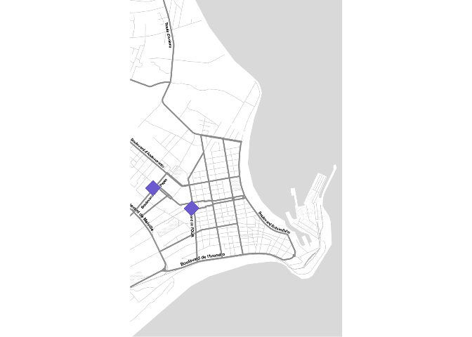
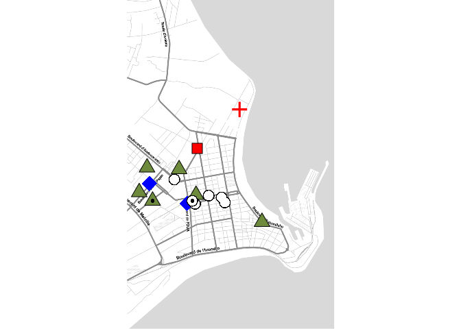
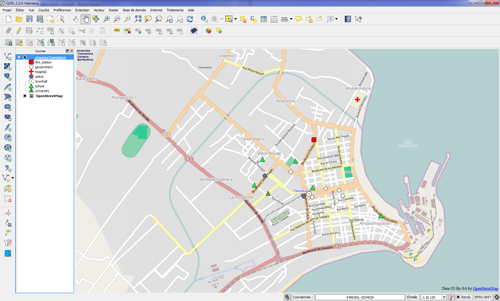

# Cartographie automatique de zones d'urgence avec R
Robin Cura - UMR Géographie-cités  
27/08/2014  


Dans ce tutoriel, on va créer, avec R, une carte permettant la localisation de services d'urgence au sein d'une zone déterminée, à l'instar des [cartes réalisées par l'équipe de bénévoles de CartONG](http://www.cartong.org/sharing/map-catalogue/1358).

On cherche ici à reproduire [la carte de Tamatave (Madagascar)](http://www.cartong.org/sites/cartong/files/20140423_MG_Tamatave-centre_osm.pdf) réalisée par le groupe [CUB](http://www.cartong.org/fr/volunteers/cub).

## Définition de l'emprise

La première étape est de définir l'emprise géographique de la carte (nommée **b**ounding**box** en anglais).
Pour cela, on récupère les coordonnées du rectangle d'emprise :

On va sur le site [BoundingBox](http://boundingbox.klokantech.com/) et on recherche la ville qui nous intéresse (Tamatave ici). On peut alors recadrer précisement la zone d'interêt, avant d'aller récuperer les coordonnées au format CSV.

  
  
On va donc pouvoir créer une première variable **R** (de type vecteur) contenant ces coordonnées

```r
bbox_Tamatave <- c(49.40045356750488,-18.17349912055989,49.431352615356445,-18.126846780513375)
```

## Choix et affichage d'un fond de carte

On va utiliser le _package_ **ggplot2** pour réaliser notre carte, et il faut donc le charger.

```r
library(ggplot2)
```

Un autre _package_, **ggmap**, permet de récuperer un fond de carte, tiré de données [OpenStreetMap](http://www.openstreetmap.org), stylisées dans ce cas par [Stamen](http://stamen.com/) dans le style [Toner-lite](http://maps.stamen.com/toner-lite/).


```r
# On charge le package
library(ggmap)

# On récupère la carte OSM d'après la variable d'emprise (bbox_Tamatave)
# Ici, on choisit le fond de carte "Toner-lite" de Stamen (nécessite ggmap >= 2.4)
fondDeCarte <- ggmap(
  get_map(location = bbox_Tamatave, maptype = 'toner-lite', source = 'stamen'),
  extent = 'device')
```

On peut alors afficher ce fond de carte


```r
fondDeCarte
```

 

## Ajout des aménités

### Construction des requêtes

La carte d'origine présente un certain nombre d'éléments permettant le repérage et l'action d'urgence dans la zone :

* Mairie
* Batiment public
* Caserne de pompier
* Hopital
* Police
* Ecole
* Université

On va utiliser les données d'OpenStreetMap pour retrouver les positions de ces différents éléments.
Pour cela, on va faire appel à une _API_ d'OpenStreetMap, [**Overpass-API**](http://wiki.openstreetmap.org/wiki/Overpass_API), permettant le requêtage à l'aide du langage **OverPassQL**.

Cette _API_ permet de récuperer une liste d'éléments, contenus dans une emprise spatiale, répondant à des critères sémantiques.
Par exemple, la requête ci-dessous, dans le langage de l'_API_, permet de récuperer les éléments de type nœuds, chemins et relations ayant comme valeur **police** à leur attribut **amenity**.
Cette requête réalise une concaténation des éléments (de chaque type géométrique) répondant à ce critère, et renvoit leurs coordonnées, ou, si besoin, les coordonnées du centroïde de ces entités (pour les polygones).

Pour des questions de commodité de traitement sous **R**, on demande à récupérer le résultat de la requête au format [JSON](http://fr.wikipedia.org/wiki/JavaScript_Object_Notation).
```
[out:json]
;
(
  node
    [amenity=police]
    (-18.174559256236886,49.393157958984375,-18.13655345030975,49.436888694763184);
  way
    [amenity=police]
    (-18.174559256236886,49.393157958984375,-18.13655345030975,49.436888694763184);
  relation
    [amenity=police]
    (-18.174559256236886,49.393157958984375,-18.13655345030975,49.436888694763184);
);
out center;
```

ou, en format "compact" :

```
[out:json];(node[amenity=police](-18.174559256236886,49.393157958984375,-18.13655345030975,49.436888694763184);way[amenity=police](-18.174559256236886,49.393157958984375,-18.13655345030975,49.436888694763184);relation[amenity=police](-18.174559256236886,49.393157958984375,-18.13655345030975,49.436888694763184););out center;
```

On va donc créer la requête permettant de récuperer la localisation de ces postes de police dans **R**.

1. Définition des attributs et valeurs recherchées

```r
tagPolices <- '[amenity=police]'
```

2. Reformatage des coordonnées de l'emprise afin de se conforter au format nécessaire () dans l'_API_ :
Les emprises sont généralement données au format Xmin/Ymin/Xmax/Ymax, mais OverPassQL requiert un format Ymin/Xmin/Ymax/Xmax.
On modifie donc l'ordre de ces coordonnés, puis on les concatène pour créer une seule chaîne de caractères depuis ce vecteur.


```r
bbox_API <- bbox_Tamatave[c(2,1,4,3)] # Le 2ème élément vient en premier, puis le 1er, le 4ème et enfin le 3ème
bbox_string <- paste(bbox_API, collapse = ',') # Conversion du vecteur en chaîne de caractère, en intercalant des virgules entre les éléments.
```

3. On peut alors commencer la constitution de la requête, qui sera composée d'une concaténation des éléments "fixes" et de nos variables : emprise et type de _tags_ recherchés.
Lors de l'utilisation de la fonction `sprintf()`, tout caractère de type `%s` sera remplacé, dans l'ordre, par l'argument donné à la fonction :
`sprintf("ABCD %s HIJ", "EFG")` retourne `"ABCD EFG HIJ`.


```r
requete <- sprintf('[out:json];(node%s(%s);way%s(%s);relation%s(%s););out center;',
                       tagPolices, bbox_string, tagPolices, bbox_string, tagPolices, bbox_string)
```

4. On peut alors constituer l'_URL_ définitive d'appel à l'_API_:
On ajoute l'adresse de la requête, et on converti au format URL (supression des éventuels espaces etc.)


```r
urlRequete <- "http://overpass-api.de/api/interpreter?data="
urlPolices <- URLencode(paste(urlRequete, requete, sep=""))

urlPolices # On affiche la requête telle qu'elle sera executée par R.
```

```
## [1] "http://overpass-api.de/api/interpreter?data=%5bout:json%5d;(node%5bamenity=police%5d(-18.1734991205599,49.4004535675049,-18.1268467805134,49.4313526153564);way%5bamenity=police%5d(-18.1734991205599,49.4004535675049,-18.1268467805134,49.4313526153564);relation%5bamenity=police%5d(-18.1734991205599,49.4004535675049,-18.1268467805134,49.4313526153564););out%20center;"
```

### Interrogation de l'_API_ et récupération des éléments géographiques

On utilise le _package_ **jsonlite** qui permettra de convertir en format R la réponse en *JSON* de l'*API* :


```r
library(jsonlite)
sortieJSON <- fromJSON(txt = urlPolices, flatten = TRUE) 
# L'argument flatten permet de "mettre à plat" les structures, c'est-à-dire de rassembler les listes de tableaux en un unique tableau
str(sortieJSON) # On affiche la structure
```

```
## List of 4
##  $ version  : num 0.6
##  $ generator: chr "Overpass API"
##  $ osm3s    :List of 2
##   ..$ timestamp_osm_base: chr "2014-08-29T16:58:02Z"
##   ..$ copyright         : chr "The data included in this document is from www.openstreetmap.org. The data is made available under ODbL."
##  $ elements :'data.frame':	2 obs. of  7 variables:
##   ..$ type         : chr [1:2] "node" "node"
##   ..$ id           : num [1:2] 6.77e+08 6.77e+08
##   ..$ lat          : num [1:2] -18.2 -18.2
##   ..$ lon          : num [1:2] 49.4 49.4
##   ..$ tags.amenity : chr [1:2] "police" "police"
##   ..$ tags.building: chr [1:2] "yes" "yes"
##   ..$ tags.name    : chr [1:2] "Hôtel de Police" "Commisariat Spécial de Police"
```

Les items *version*, *generator* et *osm3s* sont des méta-données, on n'utilisera donc que l'élément *elements* de la réponse de l'_API_, que l'on isole donc.


```r
jsonPolices <- sortieJSON$elements
```

Par soucis de clarté, on ne conserve que les éléments nécessaires de ce tableau, et on les renomme.


```r
stationsPolice <- data.frame("Nom" = jsonPolices$tags.name,
                       "Type" = jsonPolices$tags.amenity,
                       "Lat" = jsonPolices$lat,
                       "Long" = jsonPolices$lon,
                       stringsAsFactors=FALSE)
```

### Affichage de la carte de travail

On peut désormais les afficher sur la carte de fond. Pour cela, on ajoute ces éléments sous forme de ponctuels (`geom_point()`), dont l'on définit la forme (`shape = 18`, soit un losange), la couleur (*slateblue*, un bleu-gris) et la taille (8px).


```r
fondDeCarte + 
  geom_point(data = stationsPolice, aes(x = Long, y = Lat), shape=18, size=8, color="slateblue")
```

 

### Automatisation de la démarche

Pour ne pas avoir à ré-executer cette démarche pour chaque type d'entité, le plus simple est de créer une fonction, reprenant le code généré jusque-là, qui permettra une génération plus rapide de la carte finale voulue.

Cette fonction (`recupererPoints()`) prend en entrée l'attribut recherché (`tagName`, par exemple *amenity*), la valeur qu'il doit prendre (`tagValue`, par exemple *police*), et l'emprise de recherche (`bbox`).


```r
recupererPoints <- function(tagName, tagValue, bbox){
  require(jsonlite)
  
  # On crée la chaîne de caractère contenant le type d'entité à rechercher
  tagOSM <- sprintf('[%s=%s]', tagName, tagValue)
  
  # On ordonne la bbox selon le format requis par l'API
  bbox_OverPass <- paste(bbox[c(2,1,4,3)], collapse = ',')
  
  # On crée le corps de la requête
  requete_OverPass <- sprintf('[out:json];(node%s(%s);way%s(%s);relation%s(%s););out center;',
                       tagOSM, bbox_string, tagOSM, bbox_string, tagOSM, bbox_string)
  
  # On y ajoute l'url du site et on la convertie au format URL.
  requete_URL <- URLencode(paste("http://overpass-api.de/api/interpreter?data=",
                                 requete_OverPass, sep=""))
  
  # On execute la requête et récupère le tableau contenu dans l'item elements
  resultat_requete <- fromJSON(txt = requete_URL, flatten = TRUE)$elements
  
  # Si la requête ne renvoit aucun élément, on arrête la fonction en renvoyant un élément null.
  if (is.null(resultat_requete)){return(NULL)}
  
  # On place les champs de sortie dans des vecteurs :
  dfName <- resultat_requete$tags.name # Le nom de l'élément
  dfType <- resultat_requete[paste('tags', tagName, sep=".")] # Le type de l'élément
  
  # Si la géométrie est de type polygone, alors les colonnes de coordonnées du
  # tableau de résultat se nommeront center.lat et center.lon
  if (resultat_requete$type[1] == "way") {
    dfLat <- resultat_requete$center.lat
    dfLon <- resultat_requete$center.lon
  } else {
  # Sinon, elles se nomment simplement lat et lon
    dfLat <- resultat_requete$lat
    dfLon <- resultat_requete$lon
  }
  
  # On crée un nouveau tableau avec ces vecteurs que l'on vient de constituer
  tableau_sortie <- data.frame(dfName, dfType, dfLat, dfLon, stringsAsFactors = FALSE)
  
  # On leur attribue des noms explicites
  names(tableau_sortie) <- c("Nom", "Type", "Lat", "Long")
  
  # La fonction retourne, comme valeur, ce tableau clarifié et standardisé.
  return(tableau_sortie)
  }
```

En faisant appel à cette fonction, on peut maintenant rapidement ajouter les éléments à notre carte :

1. On récupère tous les points

```r
mairies <- recupererPoints('amenity', 'townhall', bbox_Tamatave)
batimentsPublics <- recupererPoints('office', 'government', bbox_Tamatave)
pompiers <- recupererPoints('amenity', 'fire_station', bbox_Tamatave)
hopitaux <- recupererPoints('amenity', 'hospital', bbox_Tamatave)
ecoles <- recupererPoints('amenity', 'school', bbox_Tamatave)
universites <- recupererPoints('amenity', 'university', bbox_Tamatave)
```


2. On crée la carte en définissant le style de chaque élément :  

    + On ajoute les casernes de pompiers : de forme carrée (`shape = 22`) et de couleur de remplissage rouge (`fill = "red"`).


```r
fondDeCarte <- fondDeCarte +
  geom_point(data = pompiers, aes(x = Long, y = Lat), shape = 22, size = 6, fill = "red")
```

    + Idem avec les hôpitaux : forme de croix (`shape = '+'`), couleur de contour rouge. Le symbole étant par défaut plus petit, on lui attribue une taille supérieure (12px)


```r
fondDeCarte <- fondDeCarte +
  geom_point(data = hopitaux, aes(x = Long, y = Lat), shape = '+', size = 12, colour = "red") 
```

    + Les stations de police (voir plus haut)
    

```r
fondDeCarte <- fondDeCarte +
  geom_point(data = stationsPolice, aes(x = Long, y = Lat), shape=18, size=8, color="blue")
```

    + Les écoles : forme triangulaire de fond vert-olive.
    

```r
fondDeCarte <- fondDeCarte +
  geom_point(data = ecoles, aes(x = Long, y = Lat), shape = 24, size = 6, fill = "darkolivegreen4")
```

    + Les université : comme les écoles, mais avec un point dans le triangle. On crée donc ce motif en superposant le triangle et le point :
    

```r
fondDeCarte <- fondDeCarte +
  geom_point(data = universites, aes(x = Long, y = Lat), shape = 24, size = 6, fill = "darkolivegreen4") +
  geom_point(data = universites, aes(x = Long, y = Lat), size = 2) # par défaut, geom_point est un point noir.
```

    + Même logique pour les bâtiments publics : un cercle blanc avec une bordure noire, que l'on crée avec deux cercles superposés, un noir plus grand et un blanc plus petit.


```r
fondDeCarte <- fondDeCarte +
  geom_point(data = batimentsPublics, aes(x = Long, y = Lat), size = 6) + # cercle noir de 6px
  geom_point(data = batimentsPublics, aes(x = Long, y = Lat), size = 5, colour="white") # cercle blanc de 5px
```

    + On fini par placer la Mairie, composée du même symbole que les bâtiments publics auxquels on ajoute un point noir.


```r
fondDeCarte <- fondDeCarte +
  geom_point(data = mairies, aes(x = Long, y = Lat), size = 6) +
  geom_point(data = mairies, aes(x = Long, y = Lat), size = 5, colour="white") +
  geom_point(data = mairies, aes(x = Long, y = Lat), size = 2)
```

### La carte finale

Ne reste plus qu'à afficher l'objet `fondDeCarte` qui contient désormais toutes les couches d'informations que l'on souhaitait représenter :


```r
fondDeCarte
```

 


## Aller plus loin : export de nos entités dans des formats SIG

Pour une mise en page plus adaptée, ou pour intégrer ces données dans un SIG classique, **R** dispose de _packages_ permettant l'inter-opérabilité.
En particulier, le _package_ **sp** met à disposition des utilisateurs des formats de données spécifiques à **R**, pensés pour contenir des objets spatiaux. Dans ce cas, il faudra d'abord convertir nos objets **R** dans ces formats spécifiques, avant de pouvoir les exporter dans des formats plus classiques.

On crée donc des objets de type **SpatialPointsDataFrame**, et on renseigne leurs caractéristiques géographiques.


```r
# On commence par rassembler nos entitées en un seul tableau :
geometries <- rbind(mairies, batimentsPublics, pompiers, hopitaux, stationsPolice[1:4], ecoles, universites)
library(sp)
# Et on peut alors leur donner leurs informations spatiales
coordinates(geometries) <- ~Long + Lat
proj4string(geometries) <- CRS("+proj=longlat +datum=WGS84")
```

Via l'utilisation de la bibliothèque logicielle [GDAL/OGR](http://www.gdal.org/), le _package_ **rgdal** permet maintenant l'export vers les formats SIG les plus habituels :

```r
library(rgdal)
# liste des formats supportés
as.character(ogrDrivers()[ogrDrivers()[,2],1])
```

```
##  [1] "BNA"            "CouchDB"        "CSV"            "DGN"           
##  [5] "DXF"            "ESRI Shapefile" "Geoconcept"     "GeoJSON"       
##  [9] "GeoRSS"         "GFT"            "GML"            "GMT"           
## [13] "GPSBabel"       "GPSTrackMaker"  "GPX"            "Interlis 1"    
## [17] "Interlis 2"     "KML"            "MapInfo File"   "Memory"        
## [21] "MSSQLSpatial"   "MySQL"          "ODBC"           "PCIDSK"        
## [25] "PGDump"         "PostgreSQL"     "S57"            "SQLite"        
## [29] "TIGER"
```


```r
# Ecriture d'un Shapefile
writeOGR(geometries, dsn = "urgenceTamatave.shp", layer = "urgenceTamatave", driver = "ESRI Shapefile",overwrite_layer = TRUE)
```

Et on peut alors ouvrir cette couche avec un logiciel SIG mieux connu.

