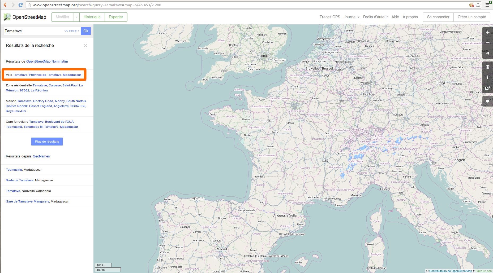
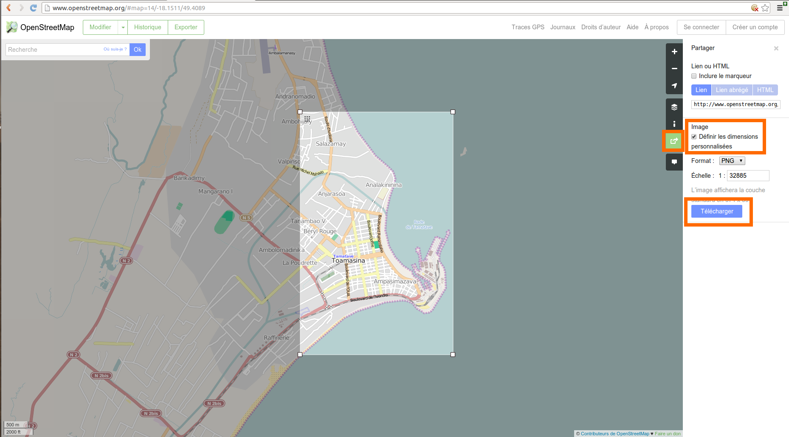

Dans ce tutoriel, on va créer, avec R, une carte permettant la localisation de services d'urgence au sein d'une zone déterminée, à l'instar des [cartes réalisées par l'équipe de bénévoles de CartONG](http://www.cartong.org/sharing/map-catalogue/1358).

On cherche ici à reproduire [la carte de Tamatave (Madagascar)](http://www.cartong.org/sites/cartong/files/20140423_MG_Tamatave-centre_osm.pdf) réalisée par le groupe [CUB](http://www.cartong.org/fr/volunteers/cub).

## Définition de l'emprise

La première étape est de définir l'emprise géographique de la carte.
Pour cela, on récupère les coordonnées du rectangle d'emprise :

1. On va sur le site de [OpenStreetMap](http://www.openstreetmap.org) et on recherche la ville qui nous intéresse (Tamatave ici)


2. Dans l'outil d'export, on choisit de créer unn un cadre personnalisé, que l'on ajuste à la zone d'étude

  
3. L'adresse url de l'image nous permet alors de récupèrer l'emprise (_bbox_) de notre zone d'étude :
  [Voir ici](http://render.openstreetmap.org/cgi-bin/export?bbox=49.40045356750488,-18.17349912055989,49.431352615356445,-18.126846780513375&scale=32885&format=png)
  
4. On va donc pouvoir créer une première variable R (de type vecteur) contenant ces coordonnées
```{r, echo=TRUE, cache=TRUE}
bbox_Tamatave <- c(49.40045356750488,-18.17349912055989,49.431352615356445,-18.126846780513375)
```

## Choix et affichage d'un fond de carte

On va utiliser le _package_ **ggplot2** pour réaliser notre carte.
```{r, echo=TRUE, cache=TRUE}
library(ggplot2)
```
Un autre _package_, **ggmap**, permet de récuperer et d'afficher une image de fond tirée d'OSM.
```{r, echo=TRUE, cache=TRUE}
# On charge le package
library(ggmap)
# On récupère la carte OSM d'après la variable d'emprise
maCarte <- ggmap(get_map(location = bbox_Tamatave, maptype = 'toner', source = 'stamen'), extent = 'device', legend = 'right',padding = 10)
# Et on peut l'afficher
maCarte
```

## Ajout des aménités

### Construction des requêtes

La carte d'origine présente un certain nombre d'éléments permettant le repérage et l'action d'urgence dans la zone :

* Mairie
* Batiment public
* Caserne de pompier
* Hopital
* Police
* Ecole
* Université

On va utiliser les données d'OpenStreetMap pour retrouver les positions de ces différents éléments.
Pour cela, on va faire appel à une _API_ d'OpenStreetMap, [**Overpass-API**](http://wiki.openstreetmap.org/wiki/Overpass_API), permettant le requêtage à l'aide du langage **OverPassQL**.

Exemple de requête OverPassQL, qui renvoit la position des mairies de la zone d'étude
```
[out:json]
;
(
  node
    ["amenity"="townhall"]
    (-18.174559256236886,49.393157958984375,-18.13655345030975,49.436888694763184);
  way
    ["amenity"="townhall"]
    (-18.174559256236886,49.393157958984375,-18.13655345030975,49.436888694763184);
  relation
    ["amenity"="townhall"]
    (-18.174559256236886,49.393157958984375,-18.13655345030975,49.436888694763184);
);
out center;
```
ou, en format compact :
```
[out:json];(node["amenity"="townhall"](-18.174559256236886,49.393157958984375,-18.13655345030975,49.436888694763184);way["amenity"="townhall"](-18.174559256236886,49.393157958984375,-18.13655345030975,49.436888694763184);relation["amenity"="townhall"](-18.174559256236886,49.393157958984375,-18.13655345030975,49.436888694763184););out center;
```

Grâce à la [*cheat-sheet* d'OSM](http://geothings.net/osm/settle/OpenStreetMap%20cheat%20sheet.pdf), on peut créer les requêtes :
```{r, echo=TRUE, cache=TRUE}
tagMairies <- '["amenity"="townhall"]'
tagBatimentsPublics <- '["amenity"="public_building"]'
tagPompiers <- '["amenity"="fire_station"]'
tagHopitaux <- '["amenity"="hospital"]'
tagPolices <- '["amenity"="police"]'
tagEcoles <- '["amenity"="school"]'
tagUniversites <-'["amenity"="university"]'
```

Dans l'appel à l'_API_, on peut choisir le format de récupération des données. Ici, on va utiliser le format _JSON_, qui sera simple à lire pour R.
On peut désormais constituer les requêtes pour télécharger la liste de ces éléments :
```{r, echo=TRUE, cache=FALSE}
# l'API ne prend pas les coordonnées dans le meme ordre...
bbox_API <- bbox_Tamatave[c(2,1,4,3)]
bbox_string <- paste(bbox_API, collapse = ',')
mainRequest <- sprintf('[out:json];(node%%s(%s);way%%s(%s);relation%%s(%s););out center;', bbox_string, bbox_string, bbox_string)
reqMairies <- sprintf(mainRequest, tagMairies, tagMairies, tagMairies)
reqBatimentsPublics <- sprintf(mainRequest, tagBatimentsPublics, tagBatimentsPublics, tagBatimentsPublics)
reqPompiers <- sprintf(mainRequest, tagPompiers, tagPompiers, tagPompiers)
reqHopitaux <- sprintf(mainRequest, tagHopitaux, tagHopitaux, tagHopitaux)
reqPolices <- sprintf(mainRequest, tagPolices, tagPolices, tagPolices)
reqEcoles <- sprintf(mainRequest, tagEcoles, tagEcoles, tagEcoles)
reqUniversites <- sprintf(mainRequest, tagUniversites, tagUniversites, tagUniversites)
```


Et on peut alors constituer les _URL_ définitives d'appel à l'_API_ :

```{r, echo=TRUE, cache=TRUE}
urlRequete <- "http://overpass-api.de/api/interpreter?data="
urlMairies <- URLencode(paste(urlRequete, reqMairies, sep=""))
urlBatimentsPublics <- URLencode(paste(urlRequete, reqBatimentsPublics, sep=""))
urlPompiers <- URLencode(paste(urlRequete, reqPompiers, sep=""))
urlHopitaux <- URLencode(paste(urlRequete, reqHopitaux, sep=""))
urlPolices <- URLencode(paste(urlRequete, reqPolices, sep=""))
urlEcoles <- URLencode(paste(urlRequete, reqEcoles, sep=""))
urlUniversites <- URLencode(paste(urlRequete, reqUniversites, sep=""))

urlMairies
```

### Interrogation de l'_API_ et récupération des éléments géographiques

On utilise le _package_ **jsonlite** qui permettra de convertir en format R la réponse en *JSON* de l'*API* :

```{r, echo=TRUE, cache=TRUE}
library(jsonlite)
jsonMairies <- fromJSON(txt = urlMairies, simplifyDataFrame = TRUE)$elements
jsonBatimentsPublics <- fromJSON(txt = urlBatimentsPublics, simplifyDataFrame = TRUE)$elements
jsonPompiers <- fromJSON(txt = urlPompiers, simplifyDataFrame = TRUE)$elements
jsonHopitaux <- fromJSON(txt = urlHopitaux, simplifyDataFrame = TRUE)$elements
jsonPolices <- fromJSON(txt = urlPolices, simplifyDataFrame = TRUE)$elements
jsonEcoles <- fromJSON(txt = urlEcoles, simplifyDataFrame = TRUE)$elements
jsonUniversites <- fromJSON(txt = urlUniversites, simplifyDataFrame = TRUE)$elements
```

On va maintenant convertir ces éléments en objets cartographiables avec R :

```{r, echo=TRUE, cache=TRUE}

```