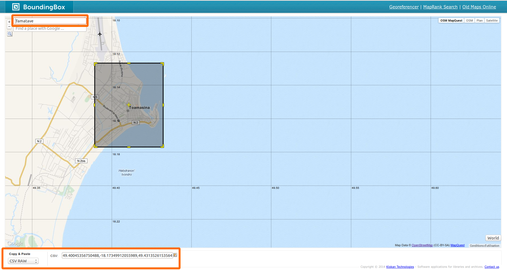
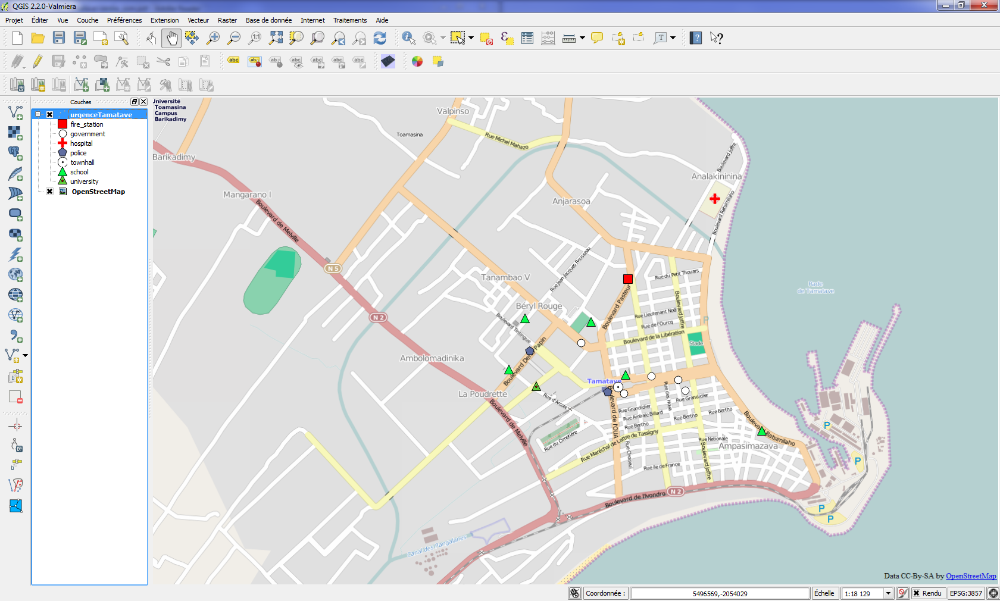

Dans ce tutoriel, on va créer, avec R, une carte permettant la localisation de services d'urgence au sein d'une zone déterminée, à l'instar des [cartes réalisées par l'équipe de bénévoles de CartONG](http://www.cartong.org/sharing/map-catalogue/1358).

On cherche ici à reproduire [la carte de Tamatave (Madagascar)](http://www.cartong.org/sites/cartong/files/20140423_MG_Tamatave-centre_osm.pdf) réalisée par le groupe [CUB](http://www.cartong.org/fr/volunteers/cub).

## Définition de l'emprise

La première étape est de définir l'emprise géographique de la carte.
Pour cela, on récupère les coordonnées du rectangle d'emprise :

On va sur le site [BoundingBox](http://boundingbox.klokantech.com/) et on recherche la ville qui nous intéresse (Tamatave ici). On peut alors recadrer précisement la zone d'interêt, avant d'aller récuperer les coordonnées au format CSV.

  
  
On va donc pouvoir créer une première variable R (de type vecteur) contenant ces coordonnées
```{r, echo=TRUE, cache=TRUE}
bbox_Tamatave <- c(49.40045356750488,-18.17349912055989,49.431352615356445,-18.126846780513375)
```

## Choix et affichage d'un fond de carte

On va utiliser le _package_ **ggplot2** pour réaliser notre carte.
```{r, echo=TRUE, cache=TRUE}
library(ggplot2)
```
Un autre _package_, **ggmap**, permet de récuperer et d'afficher une image de fond tirée d'OSM.
```{r, echo=TRUE, cache=TRUE}
# On charge le package
library(ggmap)
# On récupère la carte OSM d'après la variable d'emprise
fondDeCarte <- ggmap(get_map(location = bbox_Tamatave, maptype = 'toner', source = 'stamen'), extent = 'normal', legend = 'right')
# Et on peut l'afficher
fondDeCarte
```

## Ajout des aménités

### Construction des requêtes

La carte d'origine présente un certain nombre d'éléments permettant le repérage et l'action d'urgence dans la zone :

* Mairie
* Batiment public
* Caserne de pompier
* Hopital
* Police
* Ecole
* Université

On va utiliser les données d'OpenStreetMap pour retrouver les positions de ces différents éléments.
Pour cela, on va faire appel à une _API_ d'OpenStreetMap, [**Overpass-API**](http://wiki.openstreetmap.org/wiki/Overpass_API), permettant le requêtage à l'aide du langage **OverPassQL**.

Exemple de requête OverPassQL, qui renvoit la position des postes de police de la zone d'étude.
```
[out:json]
;
(
  node
    ["amenity"="police"]
    (-18.174559256236886,49.393157958984375,-18.13655345030975,49.436888694763184);
  way
    ["amenity"="police"]
    (-18.174559256236886,49.393157958984375,-18.13655345030975,49.436888694763184);
  relation
    ["amenity"="police"]
    (-18.174559256236886,49.393157958984375,-18.13655345030975,49.436888694763184);
);
out center;
```
ou, en format compact :
```
[out:json];(node["amenity"="police"](-18.174559256236886,49.393157958984375,-18.13655345030975,49.436888694763184);way["amenity"="police"](-18.174559256236886,49.393157958984375,-18.13655345030975,49.436888694763184);relation["amenity"="police"](-18.174559256236886,49.393157958984375,-18.13655345030975,49.436888694763184););out center;
```

On va donc créer la requête permettant de récuperer la localisation de ces postes de police dans R.

Dans l'appel à l'_API_, on peut choisir le format de récupération des données. Ici, on va utiliser le format _JSON_, qui sera simple à lire pour R.
On peut désormais constituer la requête pour télécharger la liste de ces éléments :
```{r, echo=TRUE, cache=FALSE}
tagPolices <- '["amenity"="police"]'
bbox_API <- bbox_Tamatave[c(2,1,4,3)] # l'API ne prend pas les coordonnées dans le meme ordre...
bbox_string <- paste(bbox_API, collapse = ',')
mainRequest <- sprintf('[out:json];(node%%s(%s);way%%s(%s);relation%%s(%s););out center;',
                       bbox_string, bbox_string, bbox_string)
reqPolices <- sprintf(mainRequest, tagPolices, tagPolices, tagPolices)
```

Et on peut alors constituer l'_URL_ définitive d'appel à l'_API_ :

```{r, echo=TRUE, cache=TRUE}
urlRequete <- "http://overpass-api.de/api/interpreter?data="
urlPolices <- URLencode(paste(urlRequete, reqPolices, sep=""))

urlPolices
```

### Interrogation de l'_API_ et récupération des éléments géographiques

On utilise le _package_ **jsonlite** qui permettra de convertir en format R la réponse en *JSON* de l'*API* :

```{r, echo=TRUE, cache=FALSE, warning=FALSE, message=FALSE}
library(jsonlite)
jsonPolices <- fromJSON(txt = urlPolices, simplifyDataFrame = TRUE)$elements
```

On va maintenant convertir ces éléments en objets cartographiables avec R.
On modifie la structure du tableau pour qu'il soit plus compréhensible.

```{r, echo=TRUE, cache=TRUE}
stationsPolice <- data.frame("Nom" = jsonPolices$tags$name,
                       "Type" = jsonPolices$tags$amenity,
                       "Lat" = jsonPolices$lat,
                       "Long" = jsonPolices$lon,
                       stringsAsFactors=FALSE)
```

### Création de la carte

On peut désormais les afficher sur la carte de fond :

```{r, echo=TRUE, cache=TRUE}
fondDeCarte + 
  geom_point(data = stationsPolice, aes(x = Long, y = Lat), shape=18, size=8, color="blue")
```

Pour ne pas avoir à ré-executer cette démarche pour chaque type d'entité, le plus simple est de créer une qui permettra une génération plus rapide de la carte finale voulue.

```{r, echo=TRUE, cache=TRUE}
recupererPoints <- function(tag1, tag2, bbox){
  require(jsonlite)
  tagOSM <- sprintf('[%s=%s]', tag1, tag2)
  bbox_OverPass <- paste(bbox[c(2,1,4,3)], collapse = ',')
  requete_OverPass1 <- sprintf('[out:json];(node%%s(%s);way%%s(%s);relation%%s(%s););out center;',
                       bbox_string, bbox_string, bbox_string)
  requete_OverPass2 <- sprintf(requete_OverPass1, tagOSM, tagOSM, tagOSM) 
  requete_URL <- URLencode(paste("http://overpass-api.de/api/interpreter?data=",
                                 requete_OverPass2, sep=""))
  resultat_requete <- fromJSON(txt = requete_URL, simplifyDataFrame = TRUE)$elements
  
  if (is.null(resultat_requete)){return(NULL)}
  
  dfName <- resultat_requete$tags$name
  dfType <- resultat_requete$tags[tag1]
  
  if (resultat_requete$type[1] == "way") {
    dfLat <- resultat_requete$center$lat
    dfLon <- resultat_requete$center$lon
  } else {
    dfLat <- resultat_requete$lat
    dfLon <- resultat_requete$lon
  }
  tableau_sortie <- data.frame("Nom" = dfName, "Type" = dfType, "Lat" = dfLat, "Long" = dfLon, stringsAsFactors = FALSE)
  names(tableau_sortie) <- c("Nom", "Type", "Lat", "Long")
  return(tableau_sortie)
  }
```

En faisant appel à cette fonction, on peut maintenant rapidement ajouter les éléments à notre carte

1. On récupère tous les points
```{r, echo=TRUE, cache=TRUE}
mairies <- recupererPoints('amenity', 'townhall', bbox_Tamatave)
batimentsPublics <- recupererPoints('office', 'government', bbox_Tamatave)
pompiers <- recupererPoints('amenity', 'fire_station', bbox_Tamatave)
hopitaux <- recupererPoints('amenity', 'hospital', bbox_Tamatave)
ecoles <- recupererPoints('amenity', 'school', bbox_Tamatave)
universites <- recupererPoints('amenity', 'university', bbox_Tamatave)
```

2. Et on peut afficher notre carte
```{r, echo=TRUE, cache=TRUE}
fondDeCarte + 
  # mairie
  geom_point(data = mairies, aes(x = Long, y = Lat), size = 6) +
  geom_point(data = mairies, aes(x = Long, y = Lat), size = 5, colour="white") +
  geom_point(data = mairies, aes(x = Long, y = Lat), size = 2) +
  # batiments publics
  geom_point(data = batimentsPublics, aes(x = Long, y = Lat), size = 6) +
  geom_point(data = batimentsPublics, aes(x = Long, y = Lat), size = 5, colour="white") +
  # pompiers
  geom_point(data = pompiers, aes(x = Long, y = Lat), shape = 22, size = 6, fill = "red") +
  # hopitaux
  geom_point(data = hopitaux, aes(x = Long, y = Lat), shape = '+', size = 12, colour = "red") +
  # police
  geom_point(data = stationsPolice, aes(x = Long, y = Lat), shape=18, size=8, color="blue") +
  # ecole
  geom_point(data = ecoles, aes(x = Long, y = Lat), shape = 24, size = 6, fill = "darkolivegreen4") +
  # universite
  geom_point(data = universites, aes(x = Long, y = Lat), shape = 24, size = 6, fill = "darkolivegreen4") +
  geom_point(data = universites, aes(x = Long, y = Lat), size = 2)
```

## Aller plus loin : export de nos entités dans des formats SIG

Pour une mise en page plus adaptée, ou pour intégrer ces données dans un SIG classique, **R** dispose de _packages_ permettant l'inter-opérabilité.
En particulier, le _package_ **sp** met à disposition des utilisateurs des formats de données spécifiques à **R**, pensés pour contenir des objets spatiaux. Dans ce cas, il faudra d'abord convertir nos objets **R** dans ces formats spécifiques, avant de pouvoir les exporter dans des formats plus classiques.

On crée donc des objets de type **SpatialPointsDataFrame**, et on renseigne leurs caractéristiques géographiques.

```{r, echo=TRUE, cache=TRUE}
# On commence par rassembler nos entitées en un seul tableau :
geometries <- rbind(mairies, batimentsPublics, pompiers, hopitaux, stationsPolice[1:4], ecoles, universites)
library(sp)
# Et on peut alors leur donner leurs informations spatiales
coordinates(geometries) <- ~Long + Lat
proj4string(geometries) <- CRS("+proj=longlat +datum=WGS84")
```

Via l'utilisation de la bibliothèque logicielle [GDAL/OGR](http://www.gdal.org/), le _package_ **rgdal** permet maintenant l'export vers les formats SIG les plus habituels :
```{r, echo=TRUE, cache=TRUE, message=FALSE, warning=FALSE}
library(rgdal)
# liste des formats supportés
as.character(ogrDrivers()[ogrDrivers()[,2],1])
# Ecriture d'un Shapefile
writeOGR(geometries, dsn = "urgenceTamatave.shp", layer = "urgenceTamatave", driver = "ESRI Shapefile",overwrite_layer = TRUE)
```

Et on peut alors ouvrir cette couche avec un logiciel SIG mieux connu.
